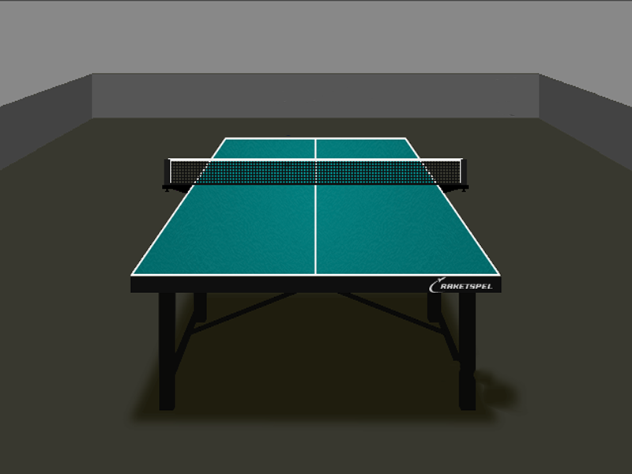
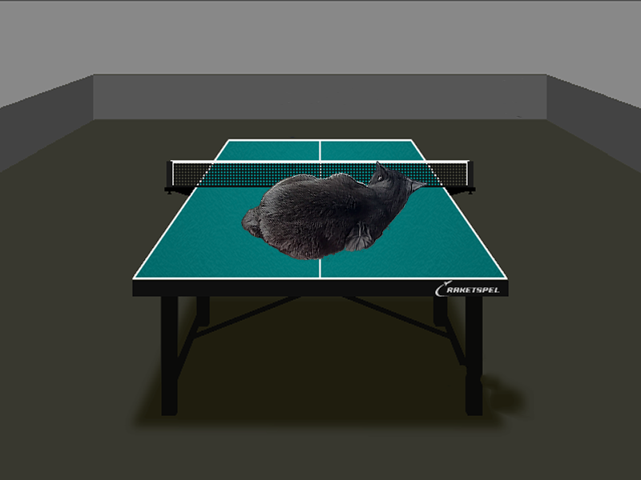

# AlphaBlending

Доброго дня всем читающим!

Этот проект посвящен оптимизации альфа-смешения (техники наложения изображений с использованием альфа-канала, т. е. байта, отвечающего за прозрачность)

# Немного теории

В используемых файлах каждому пикселю ставятся в соответствие значения красного, зелёного, синего компонентов цвета (RGB), а также альфа-значение (компонент A). Альфа-смешение меняет значение каждого цвета по формуле:

> R = B * (1 - A) + F * A

 , где **R** - результат, **B** - цвет в фоновом изображении, **F** - цвет в накладываемом изображении, **A** - прозрачность (A) в накладываемом изображении.

 # Средства

Я работаю на ноутбуке со следующими характеристиками:
 - **Процессор** AMD Ryzen 3 4300U со встроенной видеокартой
 - **Оперативная память** 12 ГБ
 - **ОС** Ubuntu 22.04.2 LTS 64-bit
 
В проекте я собираюсь применять SIMD-инструкции из набора SSE2.

 # Оптимизация

Имеется функция, накладывающая картинку с кошькой на картинку со столом. Картинки и результат приведены ниже:






Код написан без использования SIMD-инструкций:

```
void alphaBlendArrays(const sf::Uint8 *back,   sf::Vector2u back_size,
                      const sf::Uint8 *front,  sf::Vector2u front_size,
                            sf::Uint8 *result, sf::Vector2u shift) {
    unsigned int back_width  = back_size.x;
    unsigned int back_height = back_size.y;

    unsigned int front_width  = front_size.x;
    unsigned int front_height = front_size.y;

    unsigned int x_shift = shift.x;
    unsigned int y_shift = shift.y;

    for(unsigned int y = 0; y < front_height; y++)
    for(unsigned int x = 0; x < front_width; x++) 
        {
        unsigned int back_index  = 4 * ((y + y_shift) * back_width + (x + x_shift));
        unsigned int front_index = 4 * (y * front_width + x);

        for(int i = 0; i < 3; i++) 
        {
            result[back_index + i] =  (back [back_index + i]  * (255 - front[front_index + 3]) 
                                     + front[front_index + i] *        front[front_index + 3]) >> 8;
        }

        result[back_index + 3] = back[back_index + 3];
    }
}
```

Наложение вызывается из функции **main**. 

Функция **main** вызывает функцию наложения 10000 раз, после чего подсчитывает среднее время выполнения альфа-наложения. Результат первых 100 вызовов не учитывается, ибо в течение них работает кеш-память в процессоре, уменьшая время следующих выполнений.

'''
int main() {
    sf::Image back;

    if(!back.loadFromFile(back_path)) {
        printf("back picture not found!\n");
        exit(1);
    }

    sf::Image front;

    if(!front.loadFromFile(front_path)) {
        printf("front picture not found!\n");
        exit(1);
    }

    sf::Vector2u backSize = back.getSize();

    const unsigned int WIDTH  = backSize.x;
    const unsigned int HEIGHT = backSize.y;

    sf::Vector2u shift(X_SHIFT, Y_SHIFT);

    sf::Uint8* result_array = (sf::Uint8 *) calloc(4 * WIDTH * HEIGHT, sizeof(sf::Uint8));

    memcpy(result_array, back.getPixelsPtr(), 4 * WIDTH * HEIGHT);  

    const sf::Uint8 *back_array = back.getPixelsPtr();
    const sf::Uint8 *front_array = front.getPixelsPtr();

    sf::Vector2u back_size = back.getSize();
    sf::Vector2u front_size = front.getSize();

    sf::Int64 blending_time = 0;
    sf::Clock clock = sf::Clock();
    sf::Time previousTime;
    previousTime = clock.getElapsedTime();
    sf::Time currentTime;

    size_t counter = 0;
    long long unsigned ms_counter = 0;

    while(counter < FIRST_FRAMES + NUM_FRAMES) {
        alphaBlendArrays(back_array,    back_size,
                        front_array,    front_size,
                        result_array,   shift);

        currentTime = clock.getElapsedTime();
        blending_time = currentTime.asMicroseconds() - previousTime.asMicroseconds(); 
        previousTime = currentTime;

        if(counter >= FIRST_FRAMES)
            ms_counter += blending_time;
        
        counter++;
    }

    sf::Image resultImage;
    resultImage.create(WIDTH, HEIGHT, result_array);

    if(!resultImage.saveToFile(result_path)) {
        printf("Failed to save result\n");
    }

    printf("Average time: %llu ms\n", ms_counter / counter);

    free(result_array);

    return 0;
}
```

Среднее время выполнения программы - **365 мс** без флагов оптимизации и **80 мс** с флагом -O3

С целью получить меньшее время выполнения я переписал функцию **alphaBlendArrays** с использованием инструкций из расширения SSE2:

```
void alphaBlendArrays(const sf::Uint8 *back,   sf::Vector2u back_size,
                      const sf::Uint8 *front,  sf::Vector2u front_size,
                            sf::Uint8 *result, sf::Vector2u shift) {
    unsigned int back_width  = back_size.x;
    unsigned int back_height = back_size.y;

    unsigned int front_width  = front_size.x;
    unsigned int front_height = front_size.y;

    unsigned int x_shift = shift.x;
    unsigned int y_shift = shift.y;

    const sf::Uint8 Z = 0x80;

    const __m128i   _0 =                   _mm_set1_epi8(0);
    const __m128i _255 = _mm_cvtepu8_epi16(_mm_set1_epi8(255u));

    unsigned int *dest = (unsigned int*) result;

    for(unsigned int y = 0; y < front_height; y++)
    for(unsigned int x = 0; x < front_width; x += 4) 
    {
        unsigned int back_index  = 4 * ((y + y_shift) * back_width + (x + x_shift));
        unsigned int front_index = 4 * (y * front_width + x) / 16 * 16;

        __m128i fr = _mm_load_si128((__m128i*) (front + front_index));
        __m128i bk = _mm_load_si128((__m128i*) (back + back_index));

        __m128i FR = (__m128i) _mm_movehl_ps((__m128) _0, (__m128) fr);
        __m128i BK = (__m128i) _mm_movehl_ps((__m128) _0, (__m128) bk);

        fr = _mm_cvtepu8_epi16(fr);
        bk = _mm_cvtepu8_epi16(bk);

        FR = _mm_cvtepu8_epi16(FR);
        BK = _mm_cvtepu8_epi16(BK);

        static const __m128i moveA = _mm_set_epi8 (Z, 14, Z, 14, Z, 14, Z, 14,
                                                   Z,  6, Z,  6, Z,  6, Z,  6);

        __m128i a = _mm_shuffle_epi8 (fr, moveA);                               
        __m128i A = _mm_shuffle_epi8 (FR, moveA);

        fr = _mm_mullo_epi16 (fr, a);                                        
        FR = _mm_mullo_epi16 (FR, A);

        bk = _mm_mullo_epi16 (bk, _mm_sub_epi16 (_255, a));                      
        BK = _mm_mullo_epi16 (BK, _mm_sub_epi16 (_255, A));

        __m128i sum = _mm_add_epi16 (fr, bk);                                 
        __m128i SUM = _mm_add_epi16 (FR, BK);

        static const __m128i moveSum = _mm_set_epi8 ( Z,  Z,  Z, Z, Z, Z, Z, Z,
                                                     15, 13, 11, 9, 7, 5, 3, 1);

        sum = _mm_shuffle_epi8 (sum, moveSum);                                  
        SUM = _mm_shuffle_epi8 (SUM, moveSum);

        __m128i color = (__m128i) _mm_movelh_ps ((__m128) sum, (__m128) SUM);   

        _mm_store_si128 ((__m128i *) (result + back_index), color);
    }
```

Среднее время выполнения программы с флагом -O3 - **18 мс**, что порадовало

 # Вывод

Проделанная работа привела меня к выводу, что оптимизация флагами компилятора не всегда предел возможной оптимизации программы, и, к примеру, вкурив SIMD-инструкции, мы можем выжать ещё больше производительности